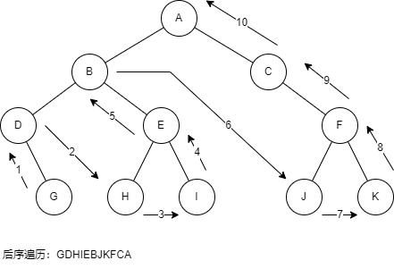

# 遍历二叉树

基于不同规则遍历会产生不同的遍历结果，遍历分为深度优先和广度优先，深度优先包含：先序遍历、中序遍历、后序遍历；广度优先包含：层次遍历。

## 先序遍历

从根节点开始，先遍历当前点，然后遍历当前节点的子树，最后遍历当前节点的子树。

### 递归算法

### 非递归算法

## 中序遍历

从根节点开始，先遍历当前节点的左子树，再遍历当前节点，最后遍历当前节点的右子树。

### 递归算法

### 非递归算法

## 后序遍历

从根节点开始，先遍历当前节点的左子树，再遍历当前节点的右子树，最后遍历当前节点。

### 递归算法

### 非递归算法

## 层次遍历